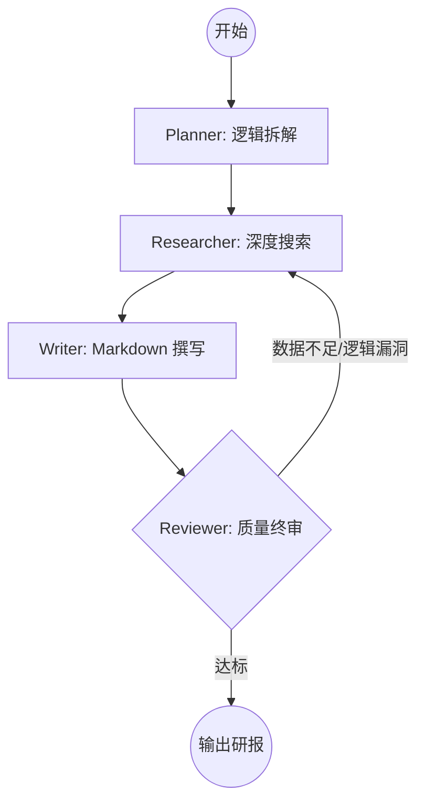

# 🚀 DeepInsight: 基于 LangGraph 的多智能体闭环研报系统

[](https://www.python.org/)
[](https://github.com/langchain-ai/langgraph)
[](LICENSE)

> **DeepInsight** 是一个工业级 Multi-Agent 协作框架原型，通过 **LangGraph** 状态机驱动。它模拟了专业智库的协作流程，实现了从模糊主题到深度 Markdown 研报的**全自动、质量受控、具备自我纠错能力**的闭环生产。

---

## 🌟 核心价值与定位

在传统的线性 Agent 流（Linear Chains）中，Agent 容易因幻觉（Hallucination）或数据缺失导致最终产物不可用。**DeepInsight** 的核心价值在于：
*   **非线性编排**：利用 LangGraph 实现复杂的循环逻辑（Loop），支持“审核-打回-重写”的动态反馈。
*   **工程化韧性**：内置限流保护、指数退避重试及状态持久化，专为生产级 LLM 应用设计。
*   **质量守门人**：引入独立的 **Reviewer** 角色，通过事实核查（Fact-Check）确保研报的严谨性。

---

## 🏗️ 架构设计 (Architecture)

系统采用高度解耦的四角色协作模型，所有状态流转均通过 `StateGraph` 进行严格定义。

### 工作流拓扑图


---

## 🤖 智能体角色定义 (Multi-Agent Roles)

| 角色 | 核心职责 | 关键技术点 |
| :--- | :--- | :--- |
| **Planner (主编)** | 任务拆解与大纲生成 | Few-shot Prompting, 逻辑树构建 |
| **Researcher (研究员)** | 跨源数据检索与清洗 | Tavily API, 内容去重, 结构化提取 |
| **Writer (主笔)** | 文本创作与 Markdown 格式化 | 上下文窗口管理, 写作风格控制 |
| **Reviewer (审核员)** | 事实核查与质量反馈 | 判定性 Prompting, 条件路由 (Conditional Edges) |

---

## 🛠️ 技术亮点与工程实践 (Job-Hunting Highlights)


### 1. 复杂状态管理与循环纠错
不同于简单的 `AgentExecutor`，本项目深度定制了 `StateGraph`。
*   **难点**：如何确保 Agent 在多次循环中不迷失方向？
*   **方案**：设计了包含 `revision_count` 的全局状态对象，配合动态 Prompt，使 Researcher 能针对 Reviewer 的反馈意见进行“定向补课”。

### 2. 工程化鲁棒性设计
本项目实现期间一直调用Modelscope的API，针对 LLM 调用不稳定的痛点，实现了：
*   **Rate Limiting**: 适配 OpenAI 接口的并发限制。
*   **Circuit Breaker**: 自动检测死循环，超过最大修订次数后强制熔断并输出当前最优版本。
*   **Pydantic Validation**: 强制所有 Agent 输出符合 Schema 定义的结构化 JSON。

### 3. 多源信息融合
集成 **Tavily AI Search**，实现了“搜索-筛选-深度读取”的三级检索流，显著降低了长篇报告中的事实错误率。

---

## 🚀 快速开始

### 环境准备
*   Python 3.12+
*   Tavily API Key (用于联网搜索)
*   OpenAI 兼容接口 (DeepSeek / ModelScope / OpenAI)

### 安装与运行
```bash
# 克隆仓库
git clone https://github.com/LessXi/DeepInsight.git
cd DeepInsight

# 安装依赖
pip install -r requirements.txt

# 配置环境变量
cp .env.example .env
# 在 .env 中填入你的配置信息

# 启动生成
python main.py --topic "2026年AI空间计算市场趋势分析"
```

---

## 📊 效果演示 (Showcase)

> [!TIP]
> **生成的报告样本可见：[agnet行业分析研报.md](output_report.md)**

真实的研报输出，可以看见当前版本还是存在一些幻觉问题没有消除

---

## 🗺️ 未来路线图 (Roadmap)

- [ ] **记忆系统**：实现RAG和Memory模块以更精准的管理Context [更新计划](upgrade.md)
- [ ] **多模态支持**：自动根据数据生成图表并嵌入 Markdown。
- [ ] **交互式 UI**：基于 Streamlit 实现可视化生成进度条。
- [ ] **本地模型适配**：支持 Llama3 / Qwen 等模型本地运行以保护隐私。

---

## 🤝 贡献与致谢

Built for Agent development learning. 
如果你觉得这个项目对你有帮助，欢迎 **Star ⭐️** 支持！


