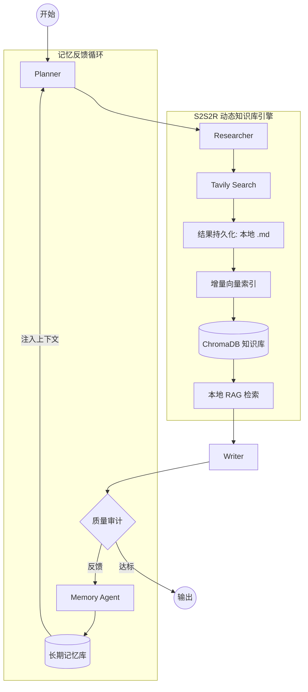

# 🚀 DeepInsight V2.0 技术升级提案：从“流程驱动”到“知识进化”

## 1. 项目愿景 (Vision)

目前的 DeepInsight V1.0 成功验证了基于 LangGraph 的多智能体闭环协作模式。V2.0 的核心目标是引入 **S2S2R (Search-to-Store-to-RAG)** 架构，通过自动化链路将全网搜索信息转化为本地持久化知识库，实现“知识随任务自动增长”的动态进化能力。

---

## 2. 核心模块升级设计：S2S2R 架构

### 📂 模块 A：动态知识库构建 (S2S2R Engine)

* **技术动机**：解决单一搜索工具（Tavily）的信息碎片化、重复计费以及缺乏长期沉淀的问题。
* **升级方案**：
  * **Search (搜索)**：Researcher 节点获取海量原始信息。
  * **Store (存储)**：新增 `Knowledge_Staging` 模块，将搜索结果（Title/URL/Content）自动清洗并格式化为本地 Markdown 文档。
  * **Index (建索引)**：利用 **ChromaDB** 监听本地文件夹，实时对新增文档进行增量向量化索引。
  * **Retrieve (RAG)**：后续生成任务优先从本地向量库检索，仅在信息不足时才触发新的 Web 搜索。
* **预期效果**：系统随着使用次数的增加，会逐渐形成一个垂直行业的私有“百科全书”。

### 🧠 模块 B：进化记忆系统 (Evolutionary Memory)

* **技术动机**：实现 Agent 对用户偏好和历史决策的深度对齐。
* **升级方案**：
  * **短期记忆 (Short-term)**：集成 LangGraph 持久化层，支持任务的中断恢复、多分支路径实验与状态回溯。
  * **长期记忆 (Long-term)**：
    * **Preference Learning**：自动从 Reviewer 的反馈中提取用户对文风、数据颗粒度、报告结构的偏好。
    * **Instruction Tuning**：将高频修正项转化为系统提示词的动态增量（Dynamic Prompting）。
* **预期效果**：实现“越用越懂你”的个性化调研体验。

---

## 3. 技术架构演进 (V2.0 Architecture)

---

## 4. 实施路线图 (Technical Roadmap)

### Phase 1: S2S2R 链路跑通

- [ ] 编写 `FilePersistenceTool`，实现搜索结果到 Markdown 的自动转换。
- [ ] 集成 ChromaDB 并实现本地文件夹的自动监听与索引。

### Phase 2: 检索路由优化

- [ ] 开发 `Search_Router`，智能判定“优先本地 RAG”还是“触发全网 Search”。
- [ ] 实现跨任务的数据融合逻辑，支持多份报告信息的交叉验证。

### Phase 3: 记忆与自适应

- [ ] 接入 SqliteSaver 实现任务级的断点续传。
- [ ] 训练简单的偏好提取 Prompt，实现长期记忆的闭环。

---

## 5. 招聘加分项说明 (For Interview)

本提案展示了应聘者在 Agent 开发领域的深度工程化思维：

1. **数据闭环能力**：S2S2R 架构展示了从“获取数据”到“治理数据”再到“应用数据”的完整闭环。
2. **成本与效率意识**：通过本地缓存与 RAG 显著降低 API 消耗，是企业级应用的核心考量。
3. **架构前瞻性**：不仅解决了当前任务，更考虑了系统的“知识复用”与“长期演进”。

---

**Author:** LessXi
**Date:** March 2026
**Project:** [DeepInsight](https://github.com/LessXi/DeepInsight)
